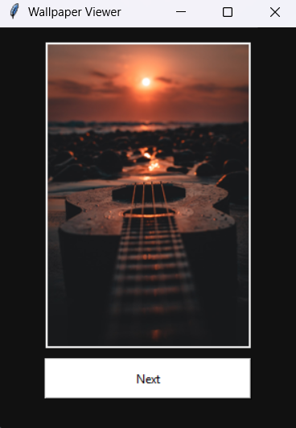

🖼️ **Wallpaper Viewer - Tkinter Project**
A simple Python GUI application to view wallpapers one-by-one using a Next button.
Built using Tkinter and PIL (Pillow).

🔧 **Features**
- GUI made with Tkinter

- Automatically loads all images from wallpapers/ folder

- Resize and display wallpapers

- "Next" button to cycle through all images

▶️ **Run the App**
- Put your images in a folder named wallpapers

- Run the Python file - python app.py

📌 **Note**
Make sure Pillow is installed:
pip install pillow

## 📸 Screenshot

